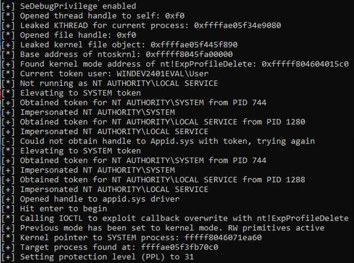

# Sunder
Windows rootkit modeled after Lazarus Group's [FudModule rootkit](https://decoded.avast.io/janvojtesek/lazarus-and-the-fudmodule-rootkit-beyond-byovd-with-an-admin-to-kernel-zero-day/). 

This version of sunder is packaged with CVE-2024-21338, a kernel callback overwrite exploit in Microsoft's Applocker driver.



## Requirements
The vulnerable [appid.sys](appid.sys) driver must be running on the target. The Applocker service MUST NOT be running in order to start the vulnerable driver service. If Applocker is running, stop the service and reboot the system. Download the vulnerable version of appid.sys from this repository, then install it:
```
sc create appidserv binPath= C:\appid.sys type= kernel
sc start appidserv
```

## Usage
Build the exploit in Visual Studio (x64, Release). Execute sunder.exe. You will receive a prompt asking which payload to run. Enter a number to execute a post-exploitation payload. 

## Stability
The appid.sys exploit (CVE-2024-21338) is highly stable. Post-exploitation functionality uses hardcoded offsets for certain Windows structs; therefore, executing the rootkit on untested OS versions may result in a Blue Screen of Death (BSOD).

## OPSEC
This exploit will likely get detected from how it steals tokens. Improving the token stealing code, or removing the token stealing code and executing from a process already running as NT AUTHORITY\LOCAL SERVICE, is recommended to evade detection. 

## References
Thanks to [Nero22k's blog](https://nero22k.github.io/posts/windows-applocker-driver-elevation-of-privilege-cve-2024-21338/) for mentioning the ExpProfileDelete function as a useful gadget for arbitrary decrements (utilized in appid.sys exploit).
